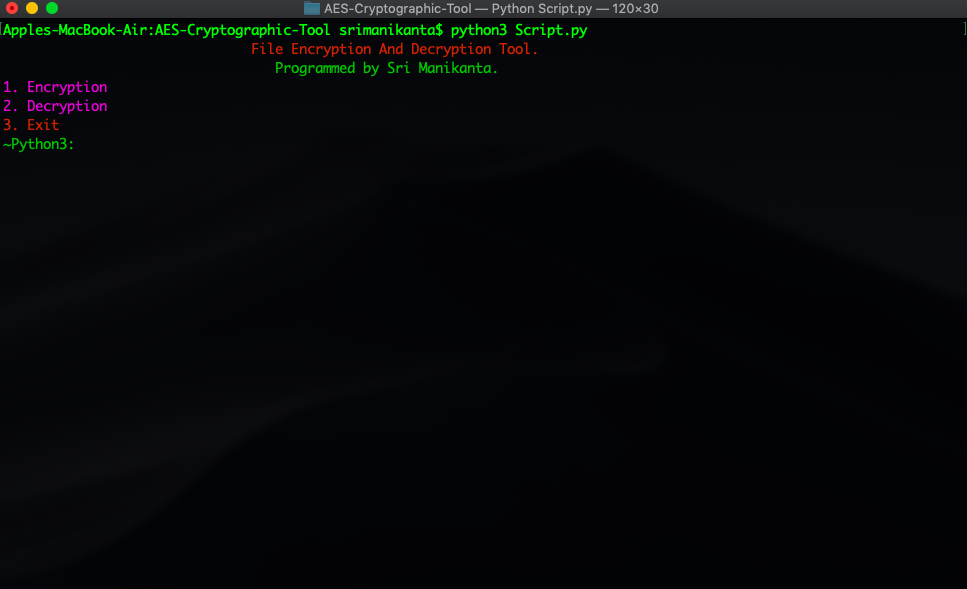

# AES Cryptographic Tool

**COMPANEY**: CODTECH IT SOLUTIONS
**NAME**: Kaustubh Dattatray Shinde
**INTERN ID**: CT08IFP
**BATCH DURATION**: January 10th, 2025 to February 10th, 2025.
**MENTOR NAME**: NEELA SANTOSH
**DESCRIPTION**: 
Penetration Testing Toolkit Description
Name: PentestPro Toolkit (Example)

Overview:
The PentestPro Toolkit is a modular framework designed for security professionals to evaluate and enhance the security posture of IT systems and networks. It consists of multiple modules, each addressing a specific aspect of penetration testing. The toolkit is flexible, extendable, and user-friendly, catering to both beginners and advanced security testers.

Core Modules
Port Scanner Module

Purpose: Identify open ports and services on a target system.
Features:
Multi-threaded scanning for speed.
Support for protocols like TCP, UDP, and SCTP.
Customizable scan options (e.g., port ranges, stealth scans).
Detailed output with service detection.
Brute-Forcer Module

AES Stands for Advanced Encryption Standards. 
A Simple Encryption and Decryption Cryptographic tool for encrypting and decrypting our files.
This tool can able to encrypt (Images/Videos/Audios/Text/) and otherfiles as well.
The files that are encrypted using this tool can only able to decrypt other than that it can't able to decrypt other encrypted files.
We can encrypt and decrypt any type of file using this tool.

### Tool Main Window:

### Installation:

#### Windows:

1. Install any python v3.x and required packages.
2. Fork the respostory into your account and Clone it into your local system.
3. Run the file Script.py and encrypt and decrypt your required files.
4. If the required file is in in the same directory there is no problem at all. otherwise you need to mention the exact path of the file with file name and it's extension.

#### Mac OSX:

1. Install any python v3.x and required packages.
2. Fork the respostory into your account and Clone it into your local system.
3. Run the file Script.py and encrypt and decrypt your required files.
4. If the required file is in in the same directory there is no problem at all. otherwise you need to mention the exact path of the file with file name and it's extension.

#### Linux:

1. Install any python v3.x and required packages.
2. Fork the respostory into your account and Clone it into your local system.
3. Run the file Script.py and encrypt and decrypt your required files.
4. If the required file is in in the same directory there is no problem at all. otherwise you need to mention the exact path of the file with file name and it's extension.

### Dependencies:

1. python v3.x is required.
2. termcolor module is required.
3. tqdm module is also required.

### Disclaimer:

Please read the license information carefully before using it commercially.

